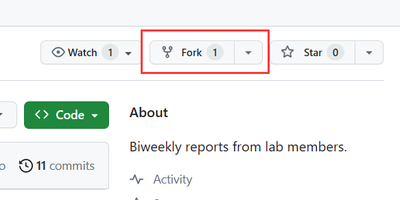
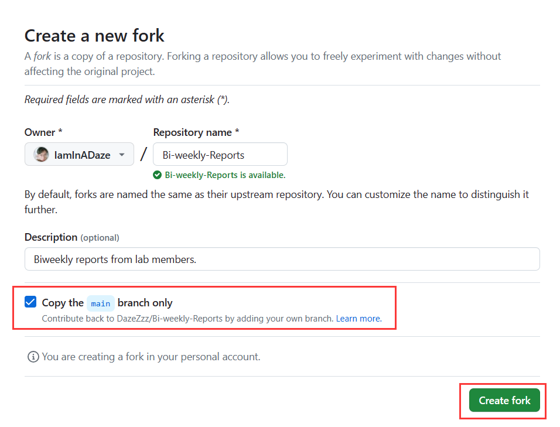
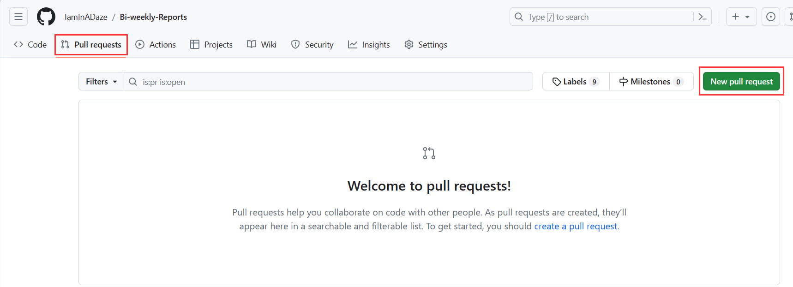
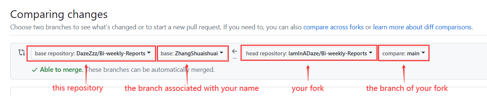
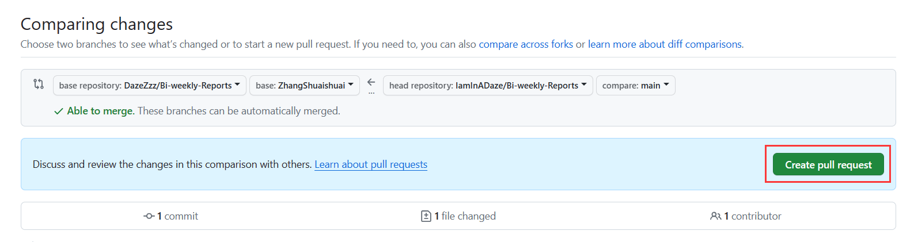

# Bi-Weekly Reports
This is a place where I keep the bi-weekly reports of my lab team.\
This repository has **six** branches in addition to the `main` branch. **Six** branches correspond to the **six** members of my lab team. Each member's branch is named after the `Chinese pinyin` of his name, and everyone's report is stored on their own branch.

## To my teammates
**You need to put your report on the branch associated with your name every two weeks.** To do this, you first need to fork the `main` branch of this repository, then write your report locally and use `Git` to push it to your fork. Finally, you need to create a `PR(Pull Request)` to submit your report from your fork to the branch of this repository that corresponds to you. I will briefly describe the steps of this process, so you can skip them if you're already familiar with them.

### Fork this repository
Click the `fork` button.



**Make sure** you check "copy the `main` branch only", then click `Create fork`.



Now you have a repository called `Bi-weekly-Reports`.

### Write your report locally and push it to your fork

You can write your report locally and use `Git` to push it to your fork. The form of the report is not specified, but `Markdown` is recommended because it's really convenient and easy to read and write, and `Github` supports it well.\
For push your report from locally, you should add your fork to your local `Git` repository by running the following command:
```
git remote add origin URL_OF_YOUR_FORK
```
This command will add a remote repository called `origin` for you. You should replace `URL_OF_YOUR_FORK` with your url.
If you want to push your report to your fork, you should run:
```
git push origin LOCAL_BRANCH_NAME:REMOTE_BRANCH_NAME
```
In the command above, `LOCAL_BRANCH_NAME` is your local `Git` branch name(usually `master`), and `REMOTE_BRANCH_NAME` is the branch name in your fork(`main` If you haven't made any changes).

### Create a Pull Request

Choose `Pull Requests` and click `New pull request`.



Choose `base repository`(this repository) and `head repository`(your fork), then choose `base`(the branch of this repository associated with your name) and `compare`(the branch of your fork)



Click `Create pull request`.



All your work has been done by now, and I will merge your `PR` to the branch associated with your name.\
You can also browse the offical documentation if you have any difficulties during your submission:\
[Git](https://git-scm.com/doc)\
[Github](https://docs.github.com/en)

## Todo
- [ ] Submit your report every two weeks.
